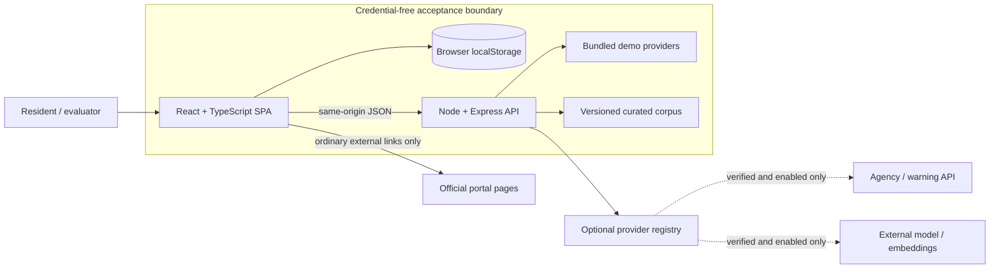
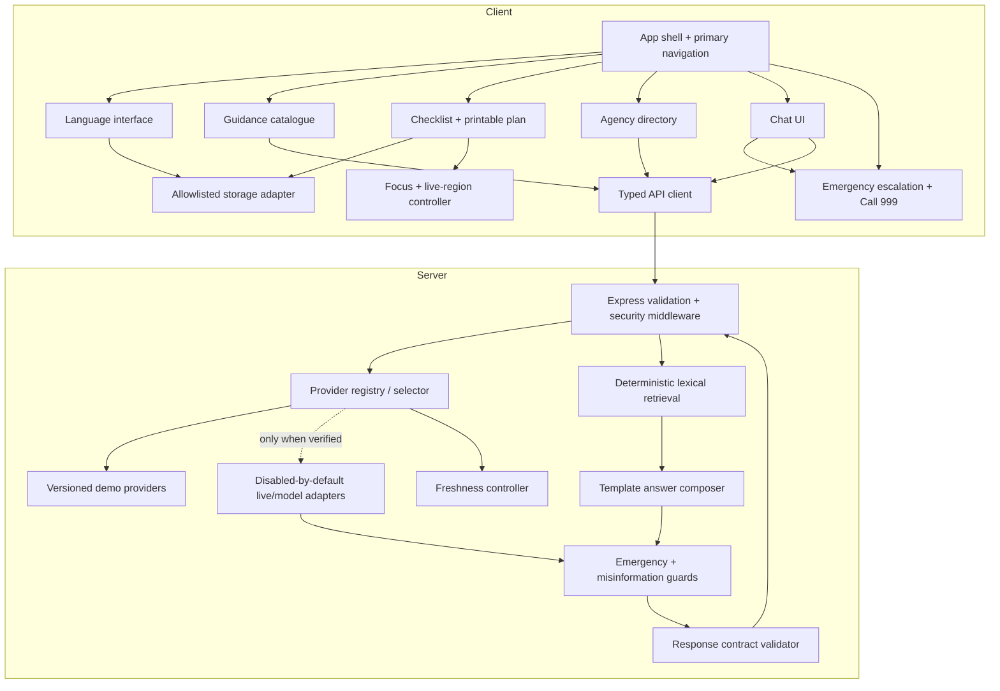
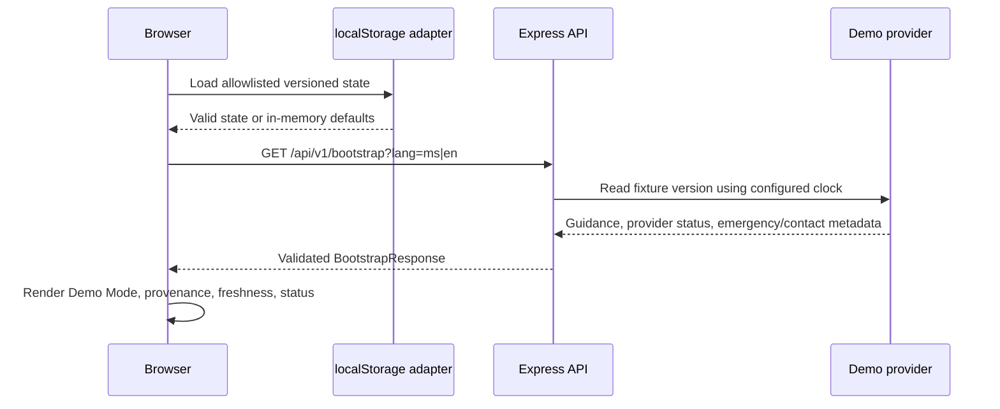
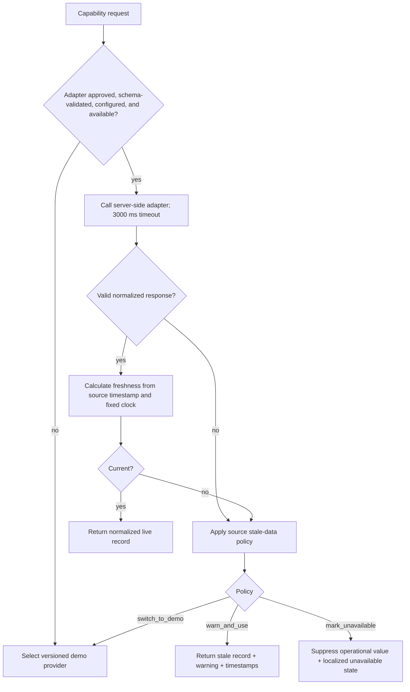
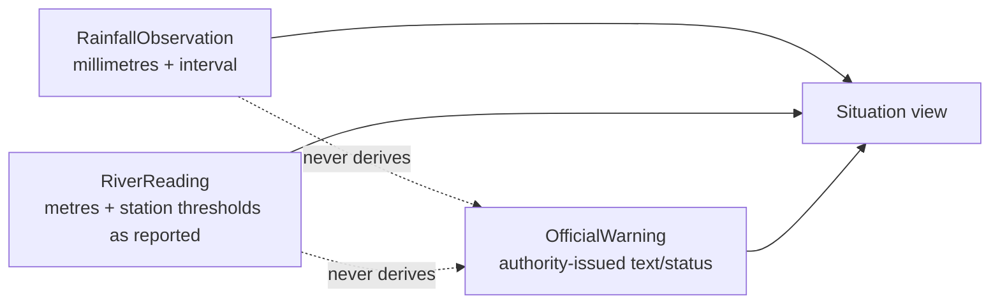

# BanjirReady MVP Design

## Overview

BanjirReady is a mobile-first, bilingual flood-preparedness prototype whose complete judged path runs locally without external credentials or outbound network access. The smallest architecture that satisfies the requirements is one React single-page application, one local Node/Express API, shared TypeScript contracts, versioned bundled fixtures, and browser `localStorage` for the narrow persistence allowlist. There is no account system, database, background worker, analytics service, vector database, or required cloud component.

The product is informational. It does not dispatch rescue, accept incident reports, calculate routes, forecast floods, infer that a location is safe, or represent government endorsement. The emergency path is deliberately deterministic and visually dominant: a matched or ambiguous emergency phrase renders a bilingual escalation block and validated Call 999 action before any conversational response. Before public deployment, the 999 fixture, agency contacts, BM translations, and all guidance review metadata require the external validation identified in the requirements.

### Goals and design principles

- **Credential-free first:** every primary journey uses bundled, deterministic, versioned data and a fixed-clock-capable provider.
- **Safety before fluency:** deterministic emergency detection and claim/citation validation wrap every answer mode, including future external models.
- **No inference of operational warnings:** rainfall observations, river readings, and official warnings are distinct data types. Raw observations may be displayed with provenance and freshness but can never create, upgrade, or imply an official flood warning.
- **Visible uncertainty:** mode, provider, freshness, `Guidance_Status`, `Demo_Data`, and limitations travel with the data and render next to actionable or operational-looking content.
- **Bilingual by construction:** BM and English use the same message keys and linked content identities; missing content fails visibly rather than silently falling back across languages.
- **Small and testable:** checklist rules, retrieval, freshness, provider selection, emergency matching, and response validation are pure functions around narrow I/O adapters.
- **Progressive enhancement:** loaded emergency guidance and the printable plan remain useful if the API or storage becomes unavailable.

### Scope additions requested for this design

The printable preparedness plan is a read-only projection of already-supported data: selected-language emergency guidance, the generated checklist, completion state, agency contacts, provenance, freshness, demo labels, and limitations. It introduces no new source of truth. Browser print styles produce a one-dimensional, ink-friendly page; the plan excludes chatbot history and any fields outside the six-field `Checklist_Profile`.

### Assumptions and blocked functionality

1. The authoritative assumptions and external-dependency register in `requirements.md` remain in force.
2. Node.js serves the Express API and the built Vite assets in demo mode; two independently deployed services are unnecessary for the hackathon.
3. A modern browser supports `localStorage`, `fetch`, CSS print media, and semantic HTML; in-memory state is the fallback when persistence fails.
4. Bundled content may be labelled `Demo_Guidance` and operational-looking records `Demo_Data` until documented review/validation is complete.
5. Agency API permission, endpoint approval, schema, rate limits, terms of use, credentials, and record-identity guarantees are unverified. Live agency ingestion is therefore blocked.
6. MET Malaysia advertises a weather web-service API, but usable warning endpoints, account approval, schema, and credentials are not established here. It is an optional adapter candidate, not a baseline dependency.
7. External language-model and embedding credentials, endpoint contracts, retention terms, and safety suitability are unverified. Remote generation and semantic retrieval are therefore blocked.
8. Government web pages such as Public InfoBanjir, MET Malaysia, and the NADMA Disaster Portal are rendered as clearly named external links. A portal page is not treated as an API, scraped at runtime, or assumed to authorize data reuse.
9. Official-warning records can originate only from an explicitly verified warning feed or a clearly labelled deterministic demo fixture whose `kind` is `official_warning`. Rainfall and river observations never enter the warning channel.
10. No portal or contact link implies endorsement by its operator.

### Research findings informing the design

- The official [Public InfoBanjir portal](https://publicinfobanjir.water.gov.my/) presents flood warnings separately from rainfall and water-level station summaries. The domain model mirrors this separation instead of deriving warnings from measurements.
- The [MET Malaysia API dashboard](https://api.met.gov.my/dashboard) describes a signup-based JSON weather service and request limits. Because the spec contains no approved account, exact endpoint contract, or permission record, this remains behind a disabled server-side adapter.
- The Government of Malaysia lists [999 as the MERS emergency hotline](https://www.malaysia.gov.my/en/categories/safety-and-community/disasters-and-emergencies). The fixture still remains `Demo_Data` until the project records the validation required by the requirements.
- The [NADMA Disaster Portal listing](https://www.malaysia.gov.my/en/topics/nadma-disaster-portal) is useful as an official outbound reference, but no API is inferred from the portal page.

External-source descriptions above are paraphrased for compliance with licensing restrictions.

## Architecture

### System context



The dashed integrations are not needed for acceptance. The browser never calls them directly and never receives secrets. The same safety pipeline handles deterministic and external-model answer candidates.

### Runtime containers

1. **Web client:** React/TypeScript/Vite/Tailwind SPA. It owns navigation, localization, rendering, emergency-first interaction, checklist editing, local persistence, print projection, focus/live-region behavior, and already-loaded emergency fallback content.
2. **Application server:** Node/Express process. It owns HTTP validation, security headers, provider registry, bundled data endpoints, curated retrieval, deterministic answer composition, server-side emergency recheck, response-contract validation, optional adapters, timeout/freshness policy, and redacted logging.
3. **Shared contracts:** TypeScript discriminated unions and runtime schemas used on both sides. Compile-time types do not replace server validation.
4. **Bundled assets:** versioned bilingual guidance, agencies, situation demo records, emergency phrase corpus, retrieval corpus, deterministic templates, checklist rules, and source metadata. Fixtures are immutable at runtime.
5. **Local storage adapter:** one namespaced/versioned envelope containing only the requirement allowlist. It falls back to memory without disabling features.

### High-level component diagram



### Primary data flows

#### Credential-free startup and browsing



#### Chat and emergency-first behavior

```mermaid
sequenceDiagram
  participant U as User
  participant C as Client emergency guard
  participant S as Express API
  participant R as Retrieval + composer
  participant G as Safety guards + contract validator
  U->>C: Submit BM or English message
  C->>C: Deterministic emergency/ambiguity match
  alt emergency or ambiguous
    C-->>U: Focus bilingual escalation and Call 999 before follow-up
  else non-emergency
    C->>S: POST /api/v1/chat
    S->>S: Validate request and re-run emergency guard
    S->>R: Retrieve 1..5 same-language corpus records
    R->>G: Candidate claims + citations + mode
    G->>G: Resolve citations; suppress unsupported/unsafe claims
    G-->>S: Valid answer or safety fallback
    S-->>C: Validated ChatResponse
    C-->>U: Answer with citations and adjacent labels
  end
```

Client emergency matching prevents UI delay; the server recheck prevents bypass. An emergency response is a structured variant, not generated prose.

#### Provider selection and freshness



Provider selection is fail-closed. `verified` is explicit configuration backed by documented approval, not inferred from the existence of a URL or credential. The normalizer must preserve provider identity, record identity, source/retrieval timestamps, and live/demo classification. The selector never sends an invalid live payload to the client.

### Situation data separation



- A `RainfallObservation` says what a station measured, with its measurement interval and unit.
- A `RiverReading` says what a station measured and may show authority-published station categories or thresholds as source data.
- An `OfficialWarning` is an authority-issued warning record with issuer, issued time, source, and status.
- Client copy must not combine observations into language such as “flood warning,” “safe,” “will flood,” or “will not flood.” Only `OfficialWarning` records render in the warning component. Demo warnings additionally render both required demo/not-current labels.

### Architectural decisions and rationale

| Decision | Rationale |
|---|---|
| One SPA plus one Express process | Smallest deployment and demo surface that meets mandated technologies and keeps credentials server-side. |
| Deterministic lexical retrieval over a small curated corpus | Works offline, is inspectable, stable under a fixed corpus/configuration, and avoids a vector service. |
| Structured answer plan before rendering | Makes actionable claims, citations, labels, and fallbacks mechanically validateable. |
| Shared static contracts plus runtime schemas | Prevents client/server drift and rejects malformed external or user payloads. |
| Pure domain functions around adapters | Enables property tests for high-risk logic without repeated network or browser cost. |
| Client and server emergency guards | Gives immediate emergency UI while preventing direct-API bypass. |
| No database or chat persistence | Meets privacy scope and removes operational overhead. |
| External portals as links | Avoids scraping and avoids representing human-facing portal pages as machine interfaces. |
| Optional adapters behind explicit capability flags | A failed/unapproved integration cannot reduce baseline capability. |
| Print as CSS projection | Meets the printable-plan request without PDF infrastructure or a second document model. |

## Components and Interfaces

### Client components

#### `AppShell`

Provides skip link, persistent Demo Mode indicator, language switcher, mobile primary navigation, limitations/privacy entry points, route-level error boundaries, and a persistent emergency action. Primary features remain one activation away at 320–767 px. Active feature, language, profile draft, and chatbot draft are React state independent of viewport/orientation.

#### `LanguageProvider`

Loads one message catalog at a time, sets `<html lang="ms|en">`, resolves localized content by linked identity, and returns a localized missing-content notice when a key is absent. A build test compares key sets and safety-message categories. Switching language cannot mutate checklist IDs, completion state, draft text, or selected feature.

```ts
interface LanguageService {
  language: Language;
  setLanguage(language: Language): void;
  text(key: MessageKey, variables?: Record<string, string | number>): string;
}
```

#### `EmergencyEscalation`

Renders a heading, bilingual water-safety instructions, Call 999 `tel:` action, no-dispatch statement, fixture-validation label when needed, and optional follow-up control. It is placed before chat output in DOM order and receives focus on emergency/ambiguous intent. Emergency guidance and contact fixture are included in the initial client bundle so the action remains operable during loading or API failure.

#### `GuidanceCatalogue`

Displays selected-language guidance records with source/version/status and exact adjacent labels. Rendering accepts text nodes only. `Reviewed_Guidance` details are displayed only when the normalized record passes complete review-metadata validation.

#### `ChecklistFeature`

Owns the six optional profile controls, calls the pure `ChecklistEngine`, displays added/retained/removed deltas, saves stable completion IDs after the privacy acknowledgement, and exposes print. Profile field order is normalized before evaluation. Unknown item IDs or rule versions trigger regeneration and a notice.

```ts
interface ChecklistEngine {
  generate(profile: ChecklistProfile, ruleSet: ChecklistRuleSet): ChecklistResult;
  reconcile(previous: ChecklistResult, next: ChecklistResult): ChecklistDelta;
  restore(saved: SavedChecklistState, profile: ChecklistProfile, currentRules: ChecklistRuleSet): RestoreResult;
}
```

#### `PrintablePlan`

Creates semantic print sections from current selected-language emergency guidance, checklist, completion state, selected agency contacts, all provenance/status/freshness labels, generated-at time, and limitations. `@media print` hides navigation, forms, chat, and nonessential controls; expands links as text where practical; uses black-on-white high contrast; and avoids page-break loss within a checklist item. It does not save or transmit a print snapshot.

#### `AgencyDirectory`

Searches normalized local response data using deterministic ranking: exact, prefix, remaining substring/token match, localized agency name, then stable ID. It renders complete telephone text and an equal-number `tel:` action, or source plus localized unavailable state. State/district fields are labels for lookup, not precise user location.

#### `ChatFeature`

Keeps an unsaved draft in memory, never writes messages to storage, routes messages through client emergency detection, and renders only validated response variants. Citation activation opens an in-app source detail panel with required metadata and optional external source link. No arbitrary HTML is accepted.

#### `StorageAdapter`

Uses one prefix (for example `banjir-ready:`), validates a versioned envelope, writes only allowlisted fields, catches security/quota/serialization failures, and exposes atomic clear-all by enumerating only prefixed keys. First save is gated by shared-device notice acknowledgement.

```ts
interface StorageAdapter {
  load(): StorageLoadResult;
  save(next: LocalState): StorageWriteResult;
  clearAll(): StorageWriteResult;
  mode(): "localStorage" | "memory";
}
```

### Server components

#### `HttpBoundary`

Defines an explicit method/path table, JSON content-type checks, 4,096 UTF-8-byte chat limit, strict object schemas with unknown-key rejection, localized error codes, request IDs, and redacted logs. Security headers include Content Security Policy, `nosniff`, referrer policy, and frame denial. Outside localhost, requests carrying personal data are rejected unless transport is encrypted or a trusted reverse-proxy signal is configured.

#### `ProviderRegistry`

Maps each capability to a demo provider and optional live provider. Selection requires all of: approved provider config, verified permission, known schema version, required server secret presence, health/availability, and feature enablement. It exposes only non-secret status fields to the browser.

```ts
interface ProviderAdapter<T> {
  readonly descriptor: ProviderDescriptor;
  fetch(input: ProviderInput, context: ProviderContext): Promise<unknown>;
  normalize(raw: unknown, context: ProviderContext): T; // validates or throws safe adapter error
}

interface ProviderSelector {
  resolve<T>(capability: Capability, context: ProviderContext): Promise<ProviderResult<T>>;
}
```

#### `DataFreshnessController`

Computes `ageMs = clock.now - sourceTimestamp` only after strict timestamp parsing. Ages from zero through the configured maximum are current; older, missing, invalid, or future timestamps are stale. It applies `warn_and_use`, `switch_to_demo`, or `mark_unavailable` without changing the record kind.

#### `RetrievalEngine`

Normalizes the selected-language question (Unicode normalization, case folding, punctuation/token handling), searches only the selected language and requested corpus version, applies deterministic weighted token/phrase scoring, filters below an explicit support threshold, and returns at most five records sorted by score descending, source date descending, and stable ID ascending. It has no web-search path.

```ts
interface RetrievalEngine {
  search(input: RetrievalRequest, corpus: CorpusVersion): RetrievalResult; // 0..5 hits
}
```

#### `AnswerComposer`

The baseline composer maps retrieved records to a versioned deterministic template and structured claims. It may paraphrase only through predefined bilingual templates; source excerpts remain bounded. An external model adapter, if later approved, receives the same retrieval set and must return the same candidate schema.

#### `EmergencySafetyGuard`

Uses a versioned bilingual phrase/pattern corpus with three results: `emergency`, `ambiguous`, or `non_emergency`. Negation and contextual examples belong in the test corpus. Emergency and ambiguous variants bypass ordinary answer generation and return escalation first.

#### `MisinformationSafetyGuard`

Validates each actionable claim against resolvable citations in the exact corpus version/language, blocks safety guarantees, forecasts, invented contacts, policy-bypass instructions, unresolved citations, and unsupported conflict resolution, then either removes dependent claims or replaces the answer with a safety fallback. It annotates claims with stale/demo labels inherited from cited sources.

#### `ChatResponseContractValidator`

Performs a final invariant check after either answer mode. Invalid candidates never reach the client.

```ts
interface ChatPipeline {
  respond(request: ChatRequest, context: RequestContext): Promise<ChatResponse>;
}
```

### HTTP API boundary

All routes are same-origin under `/api/v1`; responses are JSON, runtime-schema validated, and include a safe `requestId`. GET routes accept only documented query keys.

| Method and path | Purpose | Main response |
|---|---|---|
| `GET /api/v1/bootstrap?lang=` | Initial guidance, emergency fixture, limitations, versions, provider states | `BootstrapResponse` |
| `GET /api/v1/agencies?lang=&q=` | Deterministically ranked directory records | `AgencySearchResponse` |
| `GET /api/v1/situation?lang=` | Separate demo/live rainfall, river, and official-warning channels | `SituationResponse` |
| `POST /api/v1/chat` | Emergency recheck, retrieval, composition, safety validation | `ChatResponse` discriminated union |
| `GET /api/v1/sources/:corpusVersion/:recordId?lang=` | Resolve a citation to approved metadata and excerpt | `CitationDetail` |
| `GET /api/v1/status` | Non-secret integration/provider/freshness states | `ProviderStatusResponse` |

Checklist generation stays client-side because it is pure, small, offline-capable, and contains profile data. Rules and source references are bundled with the client and versioned. The server need not receive the household profile.

#### Request and error conventions

```ts
type ApiErrorCode =
  | "VALIDATION_CONTENT_TYPE"
  | "VALIDATION_BODY"
  | "VALIDATION_SIZE"
  | "NOT_FOUND"
  | "PROVIDER_TIMEOUT"
  | "PROVIDER_INVALID_RESPONSE"
  | "SOURCE_UNAVAILABLE"
  | "INTERNAL_ERROR";

interface ApiError {
  ok: false;
  requestId: string;
  code: ApiErrorCode;
  messageKey: MessageKey;
  retryable: boolean;
}
```

Errors never contain stack traces, paths, credentials, authorization values, raw provider bodies, chatbot text, or personal data. Localization occurs from `messageKey`; the server may include only allowlisted interpolation values.

## Data Models

Models use stable opaque IDs, explicit versions, ISO-8601 UTC timestamps at boundaries, and discriminated unions. Localized records share conceptual identity but carry language-specific content versions where needed.

### Common provenance and status

```ts
type Language = "ms" | "en";
type GuidanceStatus = "Reviewed_Guidance" | "Demo_Guidance";
type DataClass = "Demo_Data" | "Live_Data";
type FreshnessState = "current" | "stale" | "unavailable";
type StaleBehavior = "warn_and_use" | "switch_to_demo" | "mark_unavailable";

type SourceRef = {
  sourceId: string;
  title: string;
  organization: string;
  url: string;                 // ordinary outbound link, not evidence of an API
  sourceDate: string | null;
};

type ReviewMetadata = {
  reviewerName: string;
  reviewerOrganizationOrQualification: string;
  reviewDate: string;
  contentVersion: string;
  sources: SourceRef[];
};

type Provenance = {
  providerName: string;
  providerMode: "demo" | "live";
  dataClass: DataClass;
  sourceTimestamp: string | null;
  retrievalTimestamp: string;
  freshness: FreshnessState;
  fixtureVersion?: string;
};
```

`Reviewed_Guidance` is legal only when every `ReviewMetadata` value is non-empty and at least one source exists; otherwise normalization sets `Demo_Guidance`. Status is never inferred from a `.gov.my` URL.

### Guidance and corpus

```ts
type GuidanceRecord = {
  recordId: string;            // conceptual identity shared across languages
  language: Language;
  contentVersion: string;
  titleKey: MessageKey;
  body: string;
  tags: string[];
  status: GuidanceStatus;
  review: ReviewMetadata | null;
  sources: SourceRef[];
  updatedAt: string;
};

type CorpusRecord = {
  recordId: string;
  equivalentRecordId: string;  // links BM/English equivalents
  corpusVersion: string;
  language: Language;
  guidanceRecordId: string;
  title: string;
  text: string;
  normalizedTerms: string[];
  source: SourceRef;
  status: GuidanceStatus;
};
```

Search, checklist inclusion, retrieval, and language switching pass IDs and metadata rather than reconstructing records, preserving provenance and status.

### Checklist

```ts
type ChecklistProfile = {
  householdSize: number | null;
  hasChildren: boolean | null;
  hasElderlyMembers: boolean | null;
  needsMobilityAssistance: boolean | null;
  hasPets: boolean | null;
  hasTransport: boolean | null;
};

type ChecklistRule = {
  ruleId: string;
  predicate: NormalizedProfilePredicate;
  itemIds: string[];
  priority: number;
};

type ChecklistRuleSet = {
  version: string;
  baselineItemIds: string[];
  rules: ChecklistRule[];
  items: Record<string, ChecklistItemDefinition>;
};

type ChecklistItemDefinition = {
  itemId: string;
  wordingKey: MessageKey;
  sourceRefs: SourceRef[];
  guidanceStatus: GuidanceStatus;
};

type ChecklistResult = {
  ruleVersion: string;
  profileFingerprint: string;  // deterministic, local-only; not identity
  items: ChecklistItemDefinition[];
};

type ChecklistDelta = {
  added: string[];
  retained: string[];
  removed: string[];
};
```

Generation starts with baseline IDs, evaluates rules in stable priority/ID order, de-duplicates by stable item ID, and emits definitions in the resulting stable order. `profileFingerprint` is a canonical serialization/hash for comparison only and is never logged or sent to the server.

### Agency directory

```ts
type AgencyRecord = {
  recordId: string;
  fixtureVersion: string;
  language: Language;
  agencyName: string;
  role: string;
  state: string | null;
  district: string | null;
  phone: string | null;
  portalUrl: string | null;
  source: SourceRef;
  status: GuidanceStatus;
  review: ReviewMetadata | null;
  lastUpdated: string;
  provenance: Provenance;
};
```

The displayed phone text and `tel:` target derive from the same validated normalized field. Missing values remain missing; the system does not synthesize contact details.

### Situation records

```ts
type RainfallObservation = {
  kind: "rainfall_observation";
  recordId: string;
  stationId: string;
  stationName: string;
  amountMm: number;
  intervalMinutes: number;
  observedAt: string;
  source: SourceRef;
  provenance: Provenance;
};

type RiverReading = {
  kind: "river_reading";
  recordId: string;
  stationId: string;
  stationName: string;
  levelMetres: number;
  authorityReportedCategory: string | null;
  observedAt: string;
  source: SourceRef;
  provenance: Provenance;
};

type OfficialWarning = {
  kind: "official_warning";
  recordId: string;
  issuer: string;
  areaLabels: string[];
  severityLabel: string;
  warningText: string;
  issuedAt: string;
  expiresAt: string | null;
  source: SourceRef;
  provenance: Provenance;
};

type SituationRecord = RainfallObservation | RiverReading | OfficialWarning;
```

No conversion function from either observation type to `OfficialWarning` exists. Any future adapter normalizes each upstream channel directly into exactly one member of this union.

### Freshness and providers

```ts
type FreshnessPolicy = {
  category: "alert_like" | "agency" | "guidance";
  maxAgeMs: number;
  behavior: StaleBehavior;
};

type ProviderDescriptor = {
  providerName: string;
  providerMode: "demo" | "live";
  availability: "available" | "unavailable";
  verification: "verified" | "unverified";
  schemaVersion: string | null;
  fallbackProvider: string;
};

type ProviderStatus = ProviderDescriptor & {
  freshness: FreshnessState;
  nonSecretErrorCode: ApiErrorCode | null;
};
```

Defaults are 30 minutes for alert-like data, 30 days for agencies, and 180 days for guidance. Configuration can replace them, but invalid or negative values fail startup validation and cannot silently weaken freshness handling.

### Chat contracts

```ts
type ChatRequest = {
  language: Language;
  question: string;
  corpusVersion: string;
};

type Citation = {
  citationId: string;
  corpusRecordId: string;
  corpusVersion: string;
  language: Language;
  source: SourceRef;
  excerpt: string;
  guidanceStatus: GuidanceStatus;
  freshness: FreshnessState;
  dataClass: DataClass;
};

type AnswerClaim = {
  claimId: string;
  text: string;
  actionable: boolean;
  citationIds: string[];
  labels: ("stale" | "demo_data" | "demo_guidance")[];
};

type ChatResponse =
  | {
      kind: "answer";
      answerMode: "deterministic" | `external:${string}`;
      claims: AnswerClaim[];
      citations: Citation[];
      limitations: MessageKey[];
    }
  | {
      kind: "safety_fallback";
      reason: "insufficient_evidence" | "unsafe_claim" | "citation_failure" | "source_conflict";
      messageKey: MessageKey;
      citations: Citation[];
    }
  | {
      kind: "emergency" | "ambiguous_emergency";
      escalation: EmergencyEscalationModel;
      allowClarification: boolean;
    };
```

Contract invariants: every actionable claim has at least one citation ID; every citation resolves in the exact corpus version and selected language; inherited stale/demo labels are complete; an answer cannot claim location safety, predict flood behavior, invent contacts, or resolve source conflict without support; emergency variants contain no conversational answer before escalation.

### Local persistence

```ts
type LocalState = {
  schemaVersion: 1;
  language: Language;
  checklistProfile: ChecklistProfile;
  checklistRuleVersion: string;
  checklistCompletion: Record<string, boolean>;
  acknowledgedNotices: string[];
};
```

This is the entire persistence allowlist. Chat text, names, diagnoses, addresses, medication details, credentials, provider payloads, and print content have no storage field. Clear-data removes every prefixed key and resets the in-memory model.

## Correctness Properties

*A property is a characteristic or behavior that should hold true across all valid executions of a system-essentially, a formal statement about what the system should do. Properties serve as the bridge between human-readable specifications and machine-verifiable correctness guarantees.*

The properties below reflect the acceptance-criteria prework. Redundant criteria are intentionally consolidated: checklist determinism has one property, freshness boundaries have one property, citation integrity has one property, and BM/English parity has one property. Browser layout, DOM adjacency, accessibility, security headers, and complete journeys remain integration tests because repeated generated inputs would not add useful assurance.

### Property 1: Out-of-scope requests fail closed

For all recognized BM and English requests for rescue dispatch, crowdsourcing, payments, accounts, route planning, flood forecasting, or current-safety guarantees, classification produces the applicable limitation and never represents the requested capability as available.

**Validates: Requirements 1.6**

### Property 2: Presentational transitions preserve user state

For all valid client states, changing viewport orientation or selected language preserves the active feature, six profile values, checklist completion, and unsubmitted chatbot draft; language switching changes only localized presentation and document metadata.

**Validates: Requirements 2.3, 3.2**

### Property 3: Failed operations preserve durable state

For all saved local states and user-facing operation failures, applying the failure transition leaves saved values unchanged and exposes at least one retry or safe-return action.

**Validates: Requirements 2.5**

### Property 4: Missing translations never cross-fallback

For all selected languages and absent message keys, lookup returns a localized missing-content notice in the selected language and never returns content from the other language.

**Validates: Requirements 3.5**

### Property 5: Bilingual resource parity

For all resource versions admitted to a build, the BM and English catalogs have identical application-text key sets and identical safety-message category sets.

**Validates: Requirements 3.6, 17.7**

### Property 6: Guidance status is total and exclusive

For all guidance metadata combinations, normalization assigns exactly one status; it permits `Reviewed_Guidance` only when every required review field and source reference is complete, and otherwise assigns `Demo_Guidance`.

**Validates: Requirements 4.1, 4.2, 4.3**

### Property 7: Guidance provenance survives transformations

For all guidance records passed through search, checklist inclusion, chatbot retrieval, or equivalent-language selection, record identity, content version, source metadata, and guidance status remain unchanged.

**Validates: Requirements 4.6**

### Property 8: Checklist profiles have an exact schema

For all candidate profile objects, the checklist engine accepts only the six documented fields with valid values and rejects or omits every additional field, including identity, diagnosis, exact-address, and medication-profile data.

**Validates: Requirements 5.1, 5.9**

### Property 9: Empty profiles yield the versioned baseline

For all supported checklist rule sets, the profile whose six fields are unselected produces exactly that rule set's ordered baseline item list.

**Validates: Requirements 5.2**

### Property 10: Checklist generation is deterministic and order-invariant

For all valid profiles and supported rule versions, repeated generation identifies the input rule version and returns identical stable IDs, order, wording keys, source references, and statuses; permuting profile field insertion order does not change the result.

**Validates: Requirements 5.3, 5.4, 5.5, 16.3, 17.4**

### Property 11: Checklist reconciliation is a stable partition

For all previous and regenerated checklist results, reconciliation places every identifier in their union into exactly one of added, retained, or removed; added and retained follow regenerated order and removed follows previous order.

**Validates: Requirements 5.6**

### Property 12: Checklist completion round-trips

For all valid stable item identifiers, completion values, and supported rule versions, saving then loading local state preserves the identifier, completion value, and rule version.

**Validates: Requirements 5.7**

### Property 13: Unsupported saved checklists recover deterministically

For all saved checklist states containing an unsupported rule version or unknown item identifier, restoration regenerates from the current rule version and returns a version-change notice rather than accepting the invalid state.

**Validates: Requirements 5.8**

### Property 14: Agency records satisfy bilingual normalized identity

For all admitted agency fixture versions, every record has a stable identity, linked BM and English entries, agency role, contact representation, source, status, and last-updated timestamp; invalid records are rejected before serving.

**Validates: Requirements 6.1, 6.2**

### Property 15: Agency search follows the complete rank tuple

For all valid agency record sets and search queries, results are ordered by exact match, prefix match, remaining match, localized agency name, and stable record identifier.

**Validates: Requirements 6.3**

### Property 16: Demo providers are deterministic and always demo-classified

For all valid demo-provider inputs, fixture versions, and fixed clock values, repeated calls return deeply equal identifiers, values, timestamps, and order, and every returned provider record is classified `Demo_Data`.

**Validates: Requirements 7.2, 7.3**

### Property 17: Optional-provider failure preserves fallback access

For all optional-adapter failures and configured stale-data policies, provider resolution invokes the documented fallback outcome and does not disable an available credential-free baseline capability.

**Validates: Requirements 7.6, 9.4**

### Property 18: Freshness configuration is complete and unambiguous

For all accepted freshness configurations, each source category resolves to exactly one non-negative maximum age and exactly one supported stale behavior; invalid configurations are rejected.

**Validates: Requirements 8.1**

### Property 19: Freshness classification honors all boundaries

For all valid maximum ages and provider timestamps relative to a fixed clock, ages from zero through the maximum are current, ages above the maximum are stale, and absent, invalid, or future timestamps are stale.

**Validates: Requirements 8.2, 8.3, 8.4, 17.6**

### Property 20: Stale-data policy is total

For all stale normalized records, `warn_and_use` preserves the record and attaches warning/source/retrieval timestamps, `switch_to_demo` returns demo data plus replacement reason, and `mark_unavailable` returns no operational value plus localized unavailable guidance.

**Validates: Requirements 8.5, 8.6, 8.7**

### Property 21: Unverified integrations are unavailable

For all agency or model adapter configurations lacking any required credential, endpoint approval, schema, usage permission, or verification state, provider selection reports the adapter unavailable and activates its documented credential-free fallback.

**Validates: Requirements 9.2, 9.3, 9.4**

### Property 22: Browser provider status is an exact projection

For all internal provider descriptors, the public status contains only provider name, provider mode, availability, verification, freshness, fallback provider, and an optional non-secret error code, with every required field present.

**Validates: Requirements 9.1, 9.5**

### Property 23: Unsafe diagnostic values are never projected

For all internal errors, adapter responses, and log events containing credentials, authorization values, chatbot/personal text, stack traces, file paths, or provider bodies, public-error and log projections contain none of those values or their seeded markers.

**Validates: Requirements 9.6, 13.7, 14.7**

### Property 24: Live normalization preserves identity and provenance

For all valid verified live-provider records, adapter normalization preserves provider identity, stable record identity, source timestamp, retrieval timestamp, and live classification.

**Validates: Requirements 9.7**

### Property 25: Every answer mode has identical safety invariants

For all candidate answers from deterministic composition or a named external model, the same emergency, grounding, citation, privacy, refusal, stale/demo-label, and fallback validator determines acceptance.

**Validates: Requirements 9.8**

### Property 26: Retrieval is scoped, bounded, ordered, and deterministic

For all mixed-language corpora, valid questions, corpus versions, configurations, and fixed clocks, retrieval returns only selected-language records from the selected version, returns zero through five hits, orders hits by score then source date then stable ID, and repeats with identical IDs and order.

**Validates: Requirements 10.1, 10.2, 10.3**

### Property 27: Answers identify exactly one composition mode

For all valid answer responses, the response identifies exactly one mode: deterministic composition or one named external model adapter.

**Validates: Requirements 10.5**

### Property 28: Actionable claims have resolvable citation support

For all candidate answer graphs, every accepted actionable claim has at least one citation that resolves to an existing record in the identified corpus version and selected language; any dangling, wrong-version, or wrong-language citation removes the dependent claim and produces the required fallback.

**Validates: Requirements 10.4, 12.1, 12.7, 17.5**

### Property 29: Insufficient evidence suppresses requested claims

For all questions whose selected-language corpus has no evidence above the support threshold, response composition emits no requested actionable claim and returns a safety fallback.

**Validates: Requirements 10.6**

### Property 30: Credential-free answers use only retrieved records and templates

For all credential-free retrieval results and deterministic template versions, every answer claim and citation is derivable solely from those retrieved records and the selected versioned template.

**Validates: Requirements 10.8**

### Property 31: Bilingual equivalents preserve conceptual citation identity

For all linked BM and English corpus-record pairs, changing language selects the equivalent-language content while preserving the conceptual record identity used by the citation relationship.

**Validates: Requirements 10.9**

### Property 32: Emergency classification drives a constrained response contract

For all entries and supported perturbations in the versioned BM/English emergency phrase corpus, classification matches the expected result; emergency results contain escalation without an earlier conversational answer, and ambiguous results contain escalation before only a brief clarification control.

**Validates: Requirements 11.7, 11.8**

### Property 33: Unsafe certainty and fabricated claims are suppressed

For all proposed answers that claim a location is safe, predict flood behavior, invent a contact, or lack required citation support, the safety guard removes the unsupported claim and produces a safety fallback.

**Validates: Requirements 12.2**

### Property 34: Policy-bypass text cannot weaken constraints

For all user inputs or retrieved text containing instructions to bypass emergency, grounding, citation, privacy, or misinformation rules, the resulting policy configuration and enforced constraints equal the original configuration and the bypass instruction is excluded from the answer.

**Validates: Requirements 12.3**

### Property 35: Source risk labels propagate to dependent claims

For all answer claim/citation graphs, every claim derived from a stale source carries stale state and source timestamp, and every claim derived from `Demo_Data` or `Demo_Guidance` carries the corresponding bilingual demo label.

**Validates: Requirements 12.4, 12.5**

### Property 36: Conflicting sources remain explicit and unresolved

For all sets of retrieved sources that support conflicting propositions, the response identifies the conflict, cites every participating source, and does not invent an unsupported resolution.

**Validates: Requirements 12.6**

### Property 37: Persistence uses the exact allowlist

For all valid or adversarial client-state objects, local serialization contains only language, the six profile fields, checklist rule version, stable item IDs, completion states, and acknowledged notices; chatbot text, identity, diagnosis, exact address, medication data, credentials, and provider bodies are absent.

**Validates: Requirements 13.2, 13.3**

### Property 38: Clear-data is complete and namespaced

For all browser key maps containing arbitrary BanjirReady-prefixed and unrelated keys, confirmed clear-data removes every BanjirReady key, leaves unrelated keys unchanged, and restores unsaved defaults.

**Validates: Requirements 13.5**

### Property 39: Request validation is strict and byte-correct

For all methods, endpoints, content types, JSON bodies, field sets, field types, allowed values, and Unicode chatbot strings, only exact documented requests of at most 4,096 UTF-8 bytes reach application processing; every other request returns a localized validation/size error with zero application processing.

**Validates: Requirements 14.2, 14.3, 14.4**

### Property 40: Acceptance traceability is complete and honest

For all acceptance-criterion identifiers in the authoritative requirements, the traceability manifest has a mapping with test ID, requirement ID, execution type, and latest result; criteria requiring agency approval, content review, production hosting, or external credentials are classified as external-validation dependencies rather than verified.

**Validates: Requirements 17.1, 17.2, 17.10**

### Property 41: Provider timeout and invalid payloads fail closed

For all optional providers, responses arriving after 3,000 milliseconds and responses containing network errors, unsupported content types, malformed bodies, missing fields, invalid types, or disallowed values are rejected and routed through the configured stale-data policy.

**Validates: Requirements 18.3, 18.4**

### Property 42: Observations cannot become official warnings

For all normalized situation records and all presentation/composition operations, rainfall observations remain `rainfall_observation`, river readings remain `river_reading`, and neither type can produce an `official_warning` or flood-prediction claim; only directly normalized authority-warning records or explicitly labelled warning fixtures can have `official_warning` kind.

**Validates: Requirements 7.3, 12.2**

## Error Handling

The error model is explicit, localized by message key, and fail-closed for safety. Errors are converted at the nearest boundary into a discriminated result; expected failures are not thrown through React rendering, and raw provider exceptions never cross the server boundary.

### Failure and fallback matrix

| Failure | Detection boundary | User-visible behavior | Data behavior |
|---|---|---|---|
| API unavailable after initial load | Typed API client | Retain loaded emergency guidance; show localized server-unavailable notice and one retry | Do not clear storage or loaded records |
| API unavailable on first load | App shell | Render bundled emergency block, Call 999 fixture status, limitations, and retry; other server-backed sections unavailable | Continue client checklist and in-memory/local state |
| localStorage unavailable/quota failure | Storage adapter | Persistence-unavailable notice; features continue | Switch to in-memory state for the session |
| Unsupported saved rule/item | Checklist restore | Version-change notice | Regenerate from current rule set; do not trust unknown completion IDs |
| Missing translation | Language service | Localized missing-content notice | Never cross-fallback from the other language |
| Invalid user request | Express schema boundary | Localized validation or size message | No application handler runs; no body logging |
| Emergency or ambiguous intent | Client/server emergency guard | Focus escalation and Call 999 before any clarification/follow-up | Skip ordinary answer generation |
| No retrieval support | Retrieval threshold | Safety fallback plus appropriate official contacts/limitations | No unsupported claim emitted |
| Citation failure or unsafe claim | Misinformation guard | Remove dependent claim; safety fallback | Invalid candidate is discarded |
| Conflicting sources | Misinformation guard | Explain conflict and cite each source; no invented resolution | Preserve source records/statuses |
| Provider timeout/error/invalid schema | Adapter boundary | Apply configured warning/demo/unavailable state | Raw response discarded; baseline preserved |
| Stale timestamp | Freshness controller | Warn/use, replace with demo, or unavailable according to source policy | Never silently mark current |
| Future/invalid timestamp | Freshness controller | Treat as stale | Preserve safe diagnostics only |
| Unvalidated contact/guidance | Normalizer/render model | Adjacent `Demo Data` or `Demo Guidance` and validation limitation | Never upgrade status from URL/domain alone |
| Unexpected server exception | Final error middleware | Generic localized retryable/non-retryable message with request ID | Structured redacted log; no secret/body/chat text |

Retry is limited to idempotent GET requests and explicit user resubmission. The client does not automatically replay chatbot POSTs, preventing duplicate or delayed emergency interactions. Error boundaries isolate feature panels while the persistent emergency action remains outside those boundaries.

### Safety fallback precedence

1. Emergency or ambiguous intent overrides all other chatbot handling.
2. Invalid request is rejected before retrieval or providers.
3. Citation, unsafe-certainty, and policy-bypass checks override answer fluency.
4. Stale-data policy overrides live-provider preference.
5. Credential-free demo fallback overrides optional-integration failure.
6. If no safe data remains, show unavailable/limitations rather than a guessed value.

## Security and Privacy Safeguards

### Trust boundaries

- Browser input, localStorage values, fixture files, corpus text, optional-provider payloads, and model output are all untrusted until runtime-schema validated.
- External content is rendered as text. If rich content is later required, an explicit allowlist sanitizer policy and dedicated tests are prerequisites; the MVP does not need rich HTML.
- The browser communicates only with same-origin `/api/v1` endpoints. Optional credentials and authorization headers stay in server environment configuration.
- External portal URLs are validated `https:` links opened with safe link attributes. They are navigation targets, not runtime data sources.

### Server controls

- Strict route/method/content-type/body/value/unknown-key validation and UTF-8 byte-size enforcement.
- Three-second optional-provider timeout, response content-type/schema validation, bounded response size, and no redirect-to-arbitrary-origin behavior.
- Security headers: a restrictive Content Security Policy, `X-Content-Type-Options: nosniff`, restrictive `Referrer-Policy`, and `X-Frame-Options: DENY` (or equivalent CSP framing rule).
- TLS enforcement outside localhost, with explicitly configured trusted-proxy handling.
- Structured allowlist logging: request ID, route template, status, duration, safe error code, and provider name/mode only. Chat text, profile values, provider bodies, and authorization material are never logged.
- No request body persistence; chatbot text becomes unreachable when response/abort processing terminates.
- Dependency lockfile, type checking, build scanning, and production dependency audit are release gates, but do not replace input validation.

### Client privacy controls

- No account, cookies for identity, analytics, advertising, session replay, geolocation, or background location.
- Checklist profile remains client-side and is never sent to the API.
- One versioned storage envelope implements the exact allowlist; malformed stored data is ignored safely.
- A shared-browser warning precedes the first persistent write. Clear-data is explicit, confirmed, namespaced, and independently testable.
- Privacy information is generated from the storage schema and provider registry so enabled integrations and retained fields cannot drift from documentation.
- Printing is a local browser operation; no print artifact or chatbot history is retained.

## Accessibility Approach

The app targets WCAG 2.2 AA for the four primary journeys, using semantic HTML before ARIA and a deliberately simple one-column mobile information hierarchy.

- A skip link, landmark regions, one page heading, descriptive section headings, and consistent primary navigation support orientation.
- Every control is native where possible, keyboard operable, visibly focused, programmatically named, and at least 44 by 44 CSS pixels for primary mobile actions.
- Mobile layouts begin at 320 CSS pixels, avoid fixed content widths, and use wrapping/overflow guards so 200% zoom reflows into one-dimensional scrolling.
- The persistent emergency action is early in DOM/tab order. Emergency submission moves focus to the escalation heading or validated contact action; ordinary updates use a polite live region and emergencies/errors use an assertive one.
- Labels, descriptions, error messages, required/invalid states, checklist completion, and expanded citation state are programmatically associated.
- Status is never color-only: guidance, freshness, demo, completion, error, and emergency states have visible text and, if used, named icons.
- Tailwind design tokens are checked for 4.5:1 normal-text and 3:1 large-text/essential-graphic contrast. Focus indicators are not obscured.
- `prefers-reduced-motion` removes nonessential transitions. No state meaning depends on animation.
- Print order matches reading order, URLs/contact numbers remain visible, demo and freshness labels are not hidden, and checklist boxes retain clear printed outlines.
- Automated accessibility rules are complemented by keyboard-only, screen-reader spot checks, zoom/reflow checks, and BM pronunciation/language-metadata review.

## Testing Strategy

Testing follows a dual approach: example/unit tests verify concrete scenarios, edge conditions, and component integration; property tests verify universal invariants over generated inputs. Browser and external-boundary behavior is not forced into PBT where 100 repetitions would add little value.

### Test stack and deterministic controls

- **Unit/integration runner:** Vitest in non-watch mode.
- **Component tests:** React Testing Library with user-event and accessibility queries.
- **Property testing:** `fast-check` for TypeScript, using shrinking and reproducible seeds.
- **HTTP tests:** Supertest against the in-process Express app.
- **Browser journeys:** Playwright in single-run mode with outbound traffic blocked except localhost.
- **Accessibility:** an automated rule engine in component/browser tests plus documented manual checks.
- **Static gates:** TypeScript strict check, Vite production build, linting, resource parity, fixture/schema validation, and browser-bundle secret-marker scan.
- **Injected controls:** fixed clock, fixture version, corpus version, checklist rule version, provider configuration, and seeded random runs.

Every property above has exactly one corresponding `fast-check` property test with at least 100 successful iterations. A test comment must use:

```text
Feature: banjir-ready-mvp, Property {number}: {property title}
```

The run seed and shrunk counterexample are recorded on failure. Expensive browser/network operations are mocked behind pure boundaries for properties; one to three representative integration examples then validate the real wiring.

### Unit and property-test focus

| Layer | Property coverage | Focused examples/edges |
|---|---|---|
| Localization | Properties 4–5 | `html lang`, screen switcher presence, localized missing notice |
| Guidance normalization | Properties 6–7 | Reviewed/demo metadata rendering and adjacent labels |
| Checklist | Properties 8–13 | Unsupported saved version notice, first-save privacy gate, print projection |
| Directory | Properties 14–15 | Phone equality/keyboard action, missing contact, adjacent demo label |
| Providers/freshness | Properties 16–25, 41–42 | Default ages, no-network baseline, visible provider/freshness states |
| Retrieval/chat safety | Properties 26–36 | Supported/unsupported fixture questions, citation panel, emergency DOM/focus |
| Persistence/privacy | Properties 37–38 | storage exception fallback, reload, no chat retention |
| HTTP/security | Properties 23, 39, 41 | headers, TLS modes, inert content, bundle secret scan |
| Traceability | Property 40 | manifest/schema and latest-result report generation |

### Boundary and security examples

- Viewports: 320, 767, 768, and 1440 CSS pixels; 320 pixels at 200% zoom; portrait/landscape transition.
- Chat lengths: 4,095, 4,096, and 4,097 UTF-8 bytes, including BM and multibyte Unicode.
- Freshness: one millisecond below, exactly at, and one millisecond above each maximum; missing/invalid/future timestamps.
- Provider timing: immediately below, exactly at, and above the 3,000 ms timeout using fake timers.
- Text safety: script tags, event-handler markup, bidi/control characters, long tokens, malformed Unicode input, and source text containing policy-bypass instructions.
- Storage: denied access, quota exception, malformed JSON, unknown schema version, unknown checklist ID, and unrelated keys during clear.
- Emergency phrases: all versioned expected positives/negatives/ambiguous cases in BM and English, including case, punctuation, spacing, and documented negation variants.

### Integration and demo-acceptance suite

The credential-free suite starts with agency/model credentials unset and blocks non-localhost network. It verifies:

1. No credential prompt and visible `Demo Mode / Mod Demo` on each primary screen.
2. BM and English guidance with source, content version, status, demo labels, and non-endorsement limitation.
3. Deterministic checklist generation, completion persistence after reload, version recovery, privacy notice, clear-data, and printable plan.
4. Agency search and one complete demo record with contact/provenance/freshness behavior.
5. Separate rendering for a rainfall observation, river reading, and official warning fixture; only the official-warning component uses warning semantics, and all operational demo values carry not-current labels.
6. Supported and unsupported chatbot questions, resolvable citations, answer mode, source detail, and no chat/local-log retention.
7. One BM and one English emergency query with escalation/Call 999 before answer, focus movement, assertive announcement, and unvalidated-fixture label when applicable.
8. Server/storage/provider failure paths with retained emergency access and active fallback.
9. Keyboard-only primary journeys, automated accessibility scans, touch targets, reduced motion, contrast, and zoom/reflow.
10. Baseline completion with no outbound request.

### Traceability and external validation

A generated or maintained traceability manifest maps every identifier from 1.1 through 18.7 to an automated test, documented manual check, or external-validation dependency and records its latest result. It must never report the following as verified without evidence:

- Malaysian emergency-number/contact validation;
- agency name, phone, URL, or directory review;
- named guidance reviewer metadata and BM translation review;
- agency/API schema, usage permission, stable identity, endpoint, or credential approval;
- model/embedding endpoint credentials, retention terms, schema, or safety approval;
- production hosting/TLS/proxy configuration and production threat assessment;
- government endorsement.

## Requirements Coverage Summary

| Requirement | Primary design coverage | Verification mode |
|---|---|---|
| 1 — Technology/scope | Runtime containers, architectural decisions, limitations and scope classifier | Stack smoke checks, four-journey integration, Property 1 |
| 2 — Mobile first | App shell, persistent emergency action, responsive/accessibility approach, client state model | Viewport/orientation/browser checks, Properties 2–3 |
| 3 — Language parity | Language provider, bilingual linked records, missing-key behavior | Resource checks, DOM metadata examples, Properties 2, 4–5 |
| 4 — Guidance provenance | Guidance normalizer/model, review status, same-container rendering | Metadata/rendering tests, Properties 6–7 |
| 5 — Checklist | Pure checklist engine, six-field model, reconciliation, storage recovery | Unit/PBT/storage/browser tests, Properties 8–13 |
| 6 — Agency directory | Normalized bilingual agency records, deterministic ranking, phone/missing-contact UI | Fixture, PBT, component, and keyboard tests, Properties 14–15 |
| 7 — Demo providers | Versioned fixture providers, fixed clock, no-network boundary | Offline suite and Properties 16–17, 42 |
| 8 — Freshness | Freshness policies, defaults, boundary classification, stale behavior | Boundary unit/PBT and Properties 18–20 |
| 9 — Optional integrations | Server-only provider registry, verification gate, public status projection, shared guards | Mock adapter/security tests, Properties 17, 21–25 |
| 10 — Grounded RAG | Scoped lexical retrieval, templates, structured claims/citations, source detail | Retrieval/chat PBT and supported/unsupported journeys, Properties 26–31 |
| 11 — Emergency safety | Dual emergency guard, structured escalation, DOM/focus/live-region behavior | Phrase corpus PBT and BM/English browser journeys, Property 32 |
| 12 — Misinformation | Final safety guard, citation graph, conflict and metadata propagation | Adversarial PBT and fallback examples, Properties 28, 33–36, 42 |
| 13 — Privacy/local control | Exact storage schema, no chat persistence, privacy/clear/failure behavior | Storage PBT, runtime log/retention and browser tests, Properties 23, 37–38 |
| 14 — Security | Strict HTTP schemas, byte limit, text rendering, safe errors, headers/TLS | HTTP PBT, security integration and static scans, Properties 23, 39, 41 |
| 15 — Accessibility | Semantic structure, focus/live regions, keyboard, contrast, targets, reflow, reduced motion | Automated accessibility/browser checks plus documented manual review |
| 16 — Demo acceptance | Credential-free suite and deterministic delivery sequence | Ten offline end-to-end acceptance journeys |
| 17 — Testability | Fixed inputs, dual test strategy, property tags, traceability/external-dependency reporting | Test-manifest validation and Property 40 plus reused domain properties |
| 18 — Failure transparency | Provider/freshness/error matrices, persistent demo/status/limitations UI | Failure injection, adjacency/browser checks, Properties 3, 17, 41 |

Every acceptance criterion was classified during design prework as property, example, edge case, integration, or smoke coverage. The implementation-phase traceability manifest expands this summary to one row per criterion without changing requirements.

## Credential-Free Implementation Sequence

This sequence is a design recommendation, not an implementation task list. Each slice should leave a demonstrable, coherent product rather than partially wiring optional integrations.

1. **Static safety shell:** Vite/React/Tailwind/Express skeleton, shared contracts, BM/English catalogs, persistent Demo Mode, limitations/privacy views, bundled emergency guidance, Call 999 fixture state, responsive navigation, security headers, and accessibility foundations.
2. **Versioned deterministic content:** guidance fixtures, normalized agency fixtures, separate situation fixture types, provider/freshness status, provenance/status/demo labels, and portal links. At this point the app is useful without chat.
3. **Local preparedness plan:** pure checklist rules, six-field profile, privacy-gated storage, completion persistence, recovery/clear-data, and print projection.
4. **Credential-free grounded chat:** curated bilingual corpus, deterministic retrieval, templates, citation detail, structured claims, emergency recheck, misinformation guard, and fallback responses.
5. **Acceptance hardening:** property tests, request/security tests, offline Playwright journeys, accessibility/manual checks, traceability report, fixed versions/clocks, and demo script.
6. **Optional adapters only after baseline passes:** add a server-side adapter only when permission, schema, identity, credentials, rate limits, data classification, retention, and fallback policy are documented. Adapter enablement must not change baseline contracts or safety guards.

No vector database, service worker, user database, authentication, PDF service, background synchronization, or external model should be added unless a later requirement demonstrates that the simpler architecture is insufficient.

## Steering and Documentation Implications

These are design outputs for later repository documentation; this design does not create steering files, implementation code, or tasks.

- **Safety/content steering:** require emergency-first rendering, prohibition on deriving warnings or safety predictions from observations, citation support for actionable claims, and mandatory demo/stale adjacency.
- **Data-governance documentation:** define fixture/corpus/checklist versioning, reviewer metadata, source-link validation, translation review, and the rule that official-domain links alone do not confer reviewed status or endorsement.
- **Integration register:** record provider owner, capability, permission evidence, endpoint/schema version, credentials, rate limits, timestamps, identity mapping, timeout, stale policy, retention, and fallback before enablement.
- **Portal-link catalogue:** distinguish human-facing Public InfoBanjir, MET Malaysia, NADMA, and other portal links from approved APIs; prohibit runtime scraping unless separately authorized and designed.
- **Privacy/security runbook:** document the storage allowlist, clear-data process, log allowlist, secret handling, TLS/proxy assumptions, response validation, incident-free demo reset, and dependency/bundle checks.
- **Accessibility checklist:** maintain keyboard, focus, live-region, language metadata, contrast, touch target, reflow, reduced-motion, and print checks for every primary journey.
- **Demo operations guide:** pin Node/browser assumptions, fixture/corpus/rule versions, fixed-clock setup, offline-network rule, startup command, validation state of 999/contacts/content, and known limitations.
- **Traceability report:** keep acceptance mapping and external-validation dependencies adjacent to test results so hackathon readiness cannot be confused with production approval.

If later review identifies missing agency authorization, content-review detail, emergency-contact validation, or language requirements, return to requirements clarification before enabling the affected functionality.